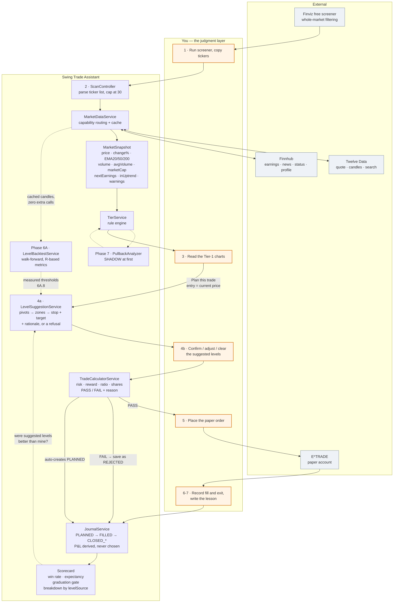
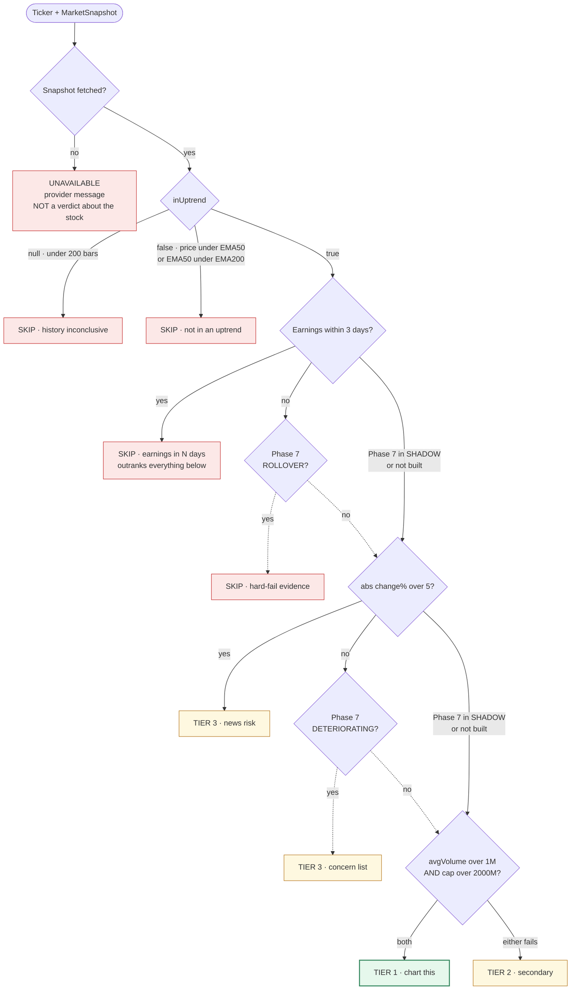

# Swing Trade Assistant — Complete Guide & Implementation Plan

*Single source of truth. Part I is for using the tool, Part II is how it fits together, Part III is what to build next.*

**Last updated:** 2026-08-02 · **Status:** Phases 1–6 shipped · 6A.1–6A.4 shipped · Phase B (scan reliability) shipped · 6A.5–6A.8 and Phase 7 open · **317 tests green · 96.0% instruction / 85.5% branch**

> ### ⚠️ Disclaimer
> This is an **educational tool for paper trading only**. It is not financial advice, it is not a recommendation to buy or sell anything, and it never places an order. It automates arithmetic and mechanical filtering; every decision about what to trade, and whether to trade at all, is yours. Trading involves real risk of loss. Nothing in this document should be read as a claim that the strategy it supports is profitable — that is precisely what the journal and the backtest harness exist to find out.

---

## Table of Contents

**Part I — Using the tool (start here if you are new to trading)**
1. [What this application is](#1-what-this-application-is)
2. [Vocabulary, with a worked example](#2-vocabulary-with-a-worked-example)
3. [The strategy in plain English](#3-the-strategy-in-plain-english)
4. [Your daily workflow](#4-your-daily-workflow)
5. [A complete worked trade, end to end](#5-a-complete-worked-trade-end-to-end)
6. [Reading each screen](#6-reading-each-screen)
7. [The rules the tool enforces, and why](#7-the-rules-the-tool-enforces-and-why)
8. [The graduation gate](#8-the-graduation-gate)
9. [Practical notes and gotchas](#9-practical-notes-and-gotchas)

**Part II — Architecture**
10. [Layer map](#10-layer-map)
11. [End-to-end data flow](#11-end-to-end-data-flow)
12. [The tiering pipeline](#12-the-tiering-pipeline)
13. [How one ticker's snapshot is assembled](#13-how-one-tickers-snapshot-is-assembled)
14. [Data providers and the request budget](#14-data-providers-and-the-request-budget)
15. [Invariants — do not break these](#15-invariants--do-not-break-these)

**Part III — Implementation plan**
16. [Tech stack](#16-tech-stack)
17. [Domain rules](#17-domain-rules)
18. [Status overview](#18-status-overview)
19. [Phases 1–5 — shipped, with decisions taken](#19-phases-15--shipped-with-decisions-taken)
20. [Phase 6 — suggested levels — shipped](#20-phase-6--suggested-stop--target-levels--shipped)
21. [Phase 6A — backtest harness — partly shipped](#21-phase-6a--backtest-harness--partly-shipped)
22. [Phase 7 — pullback quality filter — not started](#22-phase-7--pullback-quality-filter--not-started)
23. [Cross-cutting, screener sourcing, non-goals](#23-cross-cutting-tasks)
24. [What to build next](#24-what-to-build-next)

---
---

# PART I — USING THE TOOL

## 1. What this application is

You are building a **decision-support tool**, not a trading bot. The distinction matters, and the whole design hangs on it.

**What it does:** fetches price data, computes the arithmetic, applies mechanical filters that are easy to state and tedious to check by hand, proposes stop and target levels with its reasoning shown, and keeps the record of what you did and what happened.

**What it never does:** place an order, connect to a broker, tell you to buy something, or hide how it reached a conclusion.

The tool is allowed to **refuse**. If a setup fails the rules it says FAIL and gives the reason. That is the single most valuable thing it does, because the mistake that ends most beginner accounts is not picking bad stocks — it is taking a position too large for the account, and doing it repeatedly.

### The division of labour

| The tool does | You do |
|---|---|
| Fetch prices, volume, earnings dates | Run the Finviz screener |
| Compute EMAs, ATR, RSI, support/resistance zones | Look at the chart |
| Apply trend / liquidity / earnings / big-mover filters | Judge whether the setup is real |
| Propose stop and target with evidence | Confirm, adjust, or reject the proposal |
| Compute position size and risk:reward | Place the paper order in your broker |
| Record the trade and score the results | Record what actually happened, honestly |

Phase 6 shifted the stop/target line — the tool now *proposes* levels rather than leaving the fields blank. That was a deliberate change to the tool's character, and Phase 6.6 (provenance tracking) exists so you can later measure whether your levels or its levels performed better.

---

## 2. Vocabulary, with a worked example

Every term the application uses on screen, in the order you will meet them.

### The instrument and its data

**Ticker / symbol** — the short code for a stock. `VZ` is Verizon.

**Candle / bar** — one period of price action, drawn as a rectangle with wicks. This app uses **daily** candles: each one is a single trading day. Four numbers per bar:
- **Open** — first traded price of the day
- **High** — highest price of the day
- **Low** — lowest price of the day
- **Close** — last traded price of the day

Plus **volume**, the number of shares that changed hands. A green (up) candle closed above its open; a red (down) candle closed below.

**OHLCV** — shorthand for those five numbers together. It is all the app ever receives; there is no intraday data.

**Gap** — when a bar opens away from the previous close, usually on overnight news. Gaps matter because a stop-loss cannot protect you across one (see below).

### Time horizon

**Swing trading** — holding a position for roughly **2 to 15 trading days**, aiming to capture one leg of a move. Longer than day trading (minutes to hours), much shorter than investing (years). Daily candles are the natural resolution, which is why free data is sufficient.

**Long only** — you buy, hoping the price rises, and sell to close. This app has no shorting logic anywhere. Shorting has different risk mathematics and unlimited theoretical loss; it is deliberately out of scope.

### The four numbers of a trade

These four define everything the calculator does.

**Entry** — the price you intend to buy at. The tool prefills this with the current price.

**Stop (stop-loss)** — the price at which you accept the idea was wrong and sell. It goes **below** your entry. The stop is not a prediction; it is the point at which the reason you bought no longer holds. Placing it just below a support level means "if it breaks that shelf, my thesis is dead."

**Target** — the price at which you take profit. It goes **above** your entry, typically just below the next resistance level, because that is where sellers historically appeared.

**Risk per share** = entry − stop. **Reward per share** = target − entry.

### Risk and sizing — the part that actually protects you

**Risk amount** — the maximum dollars you are willing to lose on this one trade. Default **$5.00** on a $500 account. You type dollars; the app does no percentage conversion.

**Position size (shares)** = `floor(risk amount ÷ risk per share)`, then capped so you can afford the shares. Rounded **down** to whole shares.

This is the equation that makes the tool worth having. You do not decide how many shares to buy. **The distance to your stop decides it.** A tight stop means more shares, a wide stop means fewer, and either way the dollars at risk stay the same.

**Risk:reward ratio** = reward per share ÷ risk per share. The app requires **≥ 2.0**. At 2:1 you can be wrong more often than right and still come out ahead — the arithmetic tolerates a win rate below 50%. Below 2:1 you need to be right most of the time, which beginners are not.

**R** — a risk multiple, used in the backtest reports. Your stop being hit cleanly is **−1R**. A target at 2.5× your risk distance is **+2.5R**. Reporting in R rather than dollars lets results from different position sizes be compared.

### Worked example

> Account **$500**, risk **$5.00**.
> A stock trades at **$40.00**. There is a clear shelf of support at **$39.10**, and overhead resistance at **$43.60**.
>
> - Entry **$40.00**
> - Stop **$39.00** (just under the shelf, so ordinary noise at $39.10 does not trigger it)
> - Target **$43.60** (the near edge of resistance — take profit *into* it, not through it)
>
> Risk per share = 40.00 − 39.00 = **$1.00**
> Reward per share = 43.60 − 40.00 = **$3.60**
> Ratio = 3.60 ÷ 1.00 = **3.6** → passes the 2.0 minimum ✅
> Shares = floor(5.00 ÷ 1.00) = **5**
> Position cost = 5 × 40.00 = **$200** → within the $500 account ✅
> Total risk = 5 × 1.00 = **$5.00** ✅
>
> **Verdict: PASS.** If it works you make $18. If it fails you lose $5.

Now change one number. Suppose the resistance is at **$41.87** instead:

> Reward = $1.87, risk = $1.00, ratio = **1.87** → **FAIL**, "ratio 1.87 < 2.0".

Nothing about the company changed. The trade is refused because the payoff does not justify the risk. You can file it as `REJECTED` in the journal with that reason and move on — which is a decision worth recording, not a non-event.

### Chart concepts the tool computes for you

**EMA (Exponential Moving Average)** — a smoothed average of recent closing prices that weights recent days more heavily. The app computes **EMA20, EMA50 and EMA200** from daily closes, using Wilder-style smoothing so the numbers match what your E*TRADE chart draws.

Read them as: EMA20 = short-term direction, EMA50 = the intermediate trend and a common bounce zone, EMA200 = the long-term regime.

**Uptrend test** — the app's mechanical definition: **price above EMA50, and EMA50 above EMA200**. Anything else is skipped. This is not the only definition of an uptrend, but it is unambiguous and checkable, which is what a filter needs to be.

**Support** — a price area where buyers previously stepped in and the decline stopped. **Resistance** — a price area where sellers previously appeared and the advance stalled. Neither is a line in the market; both are zones, and both are interpretations.

**Swing point / pivot** — a local turning point. The app's `SwingPointDetector` marks a **swing low** as a bar whose low is below the 3 bars on either side, and a swing high as the mirror. Clusters of nearby pivots become the support and resistance zones that Phase 6 uses to propose stops and targets.

**ATR (Average True Range, 14 days)** — the average distance a stock travels in a day. Used to size the buffer beneath your stop: half an ATR below a support shelf means normal daily noise will not stop you out, while a genuine break will.

**RSI (Relative Strength Index, 14 days)** — a 0–100 momentum measure. Roughly: above 50 is bullish momentum, 40–50 is a normal pullback zone, below 40 suggests real selling pressure. Used in Phase 7. Conventional thresholds, not validated ones.

**Average volume vs. today's volume** — average volume tells you whether a stock is liquid enough to enter and exit without moving the price. Today's volume, checked mid-session, is only a partial count and means very little. The app compares against the **average** (this was a shipped bug once — a $428B company got demoted for "low volume" at 10am).

**Market cap** — company size. The app's Tier 1 threshold is **$2B**. Bigger companies move less erratically and are harder to manipulate.

**Earnings date** — the scheduled quarterly results announcement. The app **blocks any trade within 3 calendar days** of one. Earnings produce overnight gaps, and a gap can jump straight past your stop, turning a planned $5 loss into $15. Your stop protects you during the day, not overnight.

### Journal terms

**Paper trading** — recording trades you would have made, with real prices, without real money. The point is to build the habit and generate an honest track record before capital is involved.

**Status** — `PLANNED` → `FILLED` or `NO_FILL` → `CLOSED_WIN` / `CLOSED_LOSS` / `SCRATCH`. Plus `REJECTED` for setups the calculator refused.

**Win rate** — closed winners ÷ closed trades. Only `CLOSED_WIN` and `CLOSED_LOSS` count. A scratch or an unfilled order is not evidence about the strategy.

**Expectancy** — net P&L ÷ number of closed trades: the average dollars per completed trade. **This is the number that matters**, far more than win rate. A 35% win rate at 3:1 beats a 60% win rate at 1:1.

**Time stop** — exit after **15 trading days** regardless of price. Money tied up in a position that is going nowhere is money not available for a better setup, and a thesis that has not played out in three weeks usually is not going to.

**Rules-followed** — a boolean you set honestly on every closed trade. A loss where you followed your plan is a **good** trade with a bad outcome. A win where you moved your stop is a **bad** trade with a lucky outcome, and it is the more dangerous of the two because it teaches you the wrong lesson.

---

## 3. The strategy in plain English

The tool supports one specific pattern: **buying a pullback in an established uptrend.**

The reasoning:

1. **Trade with the trend.** In an uptrend the odds of continuation are better than the odds of reversal. The EMA50/EMA200 test is a crude but honest way of asking "is this thing going up?"
2. **Do not buy at the highs.** Buying after a strong run means your stop must be far away — which means a wider risk, which means fewer shares and a worse ratio.
3. **Buy the dip *within* the trend.** Wait for a pullback toward support or the 50-EMA. Now the nearby support gives you a logical stop close to your entry, and the recent high gives you an obvious target. Same trade, much better geometry.
4. **Only if the payoff is worth it.** Ratio ≥ 2:1 or no trade.
5. **Never risk more than you decided in advance.** $5, every time, regardless of conviction. Conviction is not evidence.

**And here is the hard part, which is what Phase 7 is about.** A pullback and the start of a real breakdown look identical for the first few days. The difference is in *how* the decline happens:

| Healthy pullback | Rollover / distribution |
|---|---|
| Small candles, orderly drift | Large red candles |
| Volume drying up on the decline | Volume rising on the decline |
| Price stabilising near the 50-EMA, ranges contracting | Still making lower lows |
| RSI holding in the 40–50 zone | RSI slicing below 40 |

Reading that distinction is currently a judgment you make by eye. Phase 7 encodes it — carefully, and in shadow mode first, because a filter that is confidently wrong is worse than no filter.

---

## 4. Your daily workflow

Roughly 20 minutes after the close, or before the open.

```
  ┌─ 1. SCREEN ──────────────────────────────────────────────┐
  │ Finviz free screener, ~30 seconds.                       │
  │ Copy the resulting tickers (10–25 of them).              │
  │ The app deliberately does not replicate this.            │
  └──────────────────────────────────────────────────────────┘
                            ↓  paste
  ┌─ 2. SCAN ────────────────────────────────────────────────┐
  │ Paste into the scan textarea, or hit "Scan my watchlist". │
  │ App fetches everything and returns a tiered table.        │
  │ Cold scan of 20 names ≈ 5 minutes (rate limit). Cached    │
  │ repeats are instant. Go make coffee.                      │
  └──────────────────────────────────────────────────────────┘
                            ↓  Tier 1 / Tier 2 rows
  ┌─ 3. CHART ───────────────────────────────────────────────┐
  │ YOUR JOB. Open the Tier-1 names in E*TRADE.               │
  │ Does this look like an orderly pullback in an uptrend,    │
  │ or is it falling apart? Skip anything that looks wrong,   │
  │ regardless of what the tier says.                         │
  └──────────────────────────────────────────────────────────┘
                            ↓  click "Plan this trade"
  ┌─ 4. PLAN ────────────────────────────────────────────────┐
  │ Calculator opens: entry prefilled with current price,     │
  │ stop and target prefilled as SUGGESTIONS with reasoning   │
  │ and a chart. Confirm, adjust, or clear and set your own.  │
  │ → risk, reward, ratio, shares, PASS or FAIL + reason.     │
  └──────────────────────────────────────────────────────────┘
                            ↓  PASS
  ┌─ 5. PLACE ───────────────────────────────────────────────┐
  │ YOUR JOB. Enter the paper order in E*TRADE yourself:      │
  │ buy N shares at the entry, stop-loss at the stop.         │
  │ The app never touches your broker.                        │
  │ A PLANNED journal entry is created automatically.         │
  └──────────────────────────────────────────────────────────┘
                            ↓  next day
  ┌─ 6. RECORD ──────────────────────────────────────────────┐
  │ Filled? → FILLED with the actual fill price.              │
  │ Never triggered? → NO_FILL. (Not a failure. Data.)        │
  └──────────────────────────────────────────────────────────┘
                            ↓  on exit
  ┌─ 7. CLOSE ───────────────────────────────────────────────┐
  │ Target hit, stop hit, or 15 days elapsed → close it.      │
  │ Enter the exit price. P&L is computed, and the WIN/LOSS/  │
  │ SCRATCH verdict is DERIVED from the number — you cannot   │
  │ file a loser as a win.                                    │
  │ Required: one-sentence lesson + rules-followed yes/no.    │
  └──────────────────────────────────────────────────────────┘
                            ↓  weekly
  ┌─ 8. REVIEW ──────────────────────────────────────────────┐
  │ Journal list = your scorecard. Win rate, expectancy, net  │
  │ P&L, graduation progress. Read your own lessons back.     │
  └──────────────────────────────────────────────────────────┘
```

If you do nothing else with this application, do steps 5 through 8 honestly. The scorecard is the product; everything upstream is convenience.

---

## 5. A complete worked trade, end to end

**Monday evening.** Finviz screen returns 14 tickers. Paste, scan. Four minutes later:

```
TIER 1
  VZ    $40.12   +0.4%   EMA50 $39.80   EMA200 $37.10   avg vol 18.2M   cap $169B
  KO    $61.40   −0.8%   EMA50 $60.95   EMA200 $58.20   avg vol  14.1M  cap $265B
TIER 2
  CARR  $58.30   +1.1%   EMA50 $57.60   EMA200 $54.90   avg vol   4.9M  cap $49B
TIER 3
  NVDA  $132.80  +6.2%   — up 6.2% today, news risk
  CI    $310.20  −0.3%   — earnings in 2 days
SKIP
  INTC  $21.40   — below 50-EMA
  BA    $178.90  — 50-EMA below 200-EMA, not in uptrend
UNAVAILABLE
  XYZW  — unknown symbol
```

Note what happened: seven names eliminated without you opening a single chart. CI is a perfectly good-looking setup that is blocked purely because earnings are in two days — exactly the trap that costs beginners a multiple of their planned risk.

**You chart VZ, KO and CARR.** KO's pullback looks sloppy — three big red candles on heavy volume. You skip it by eye. (Phase 7 is the attempt to catch that automatically.)

**Click "Plan this trade" on VZ.** Calculator opens:

```
Entry   40.12  (current price)
Stop    39.00  [suggested]  support zone 39.10–39.25, 3 touches,
                            most recent 6 bars ago, minus 0.5×ATR buffer
Target  43.60  [suggested]  resistance zone 43.60–43.95, 4 touches,
                            near edge used per "take profit into resistance"
                            [ Clear and set them myself ]
```

The inline chart shows 120 bars with both zones shaded. You check it against your E*TRADE chart, agree with the stop, but think resistance is really at $43.20. You edit the target. The journal will record this as `EDITED`, not `SUGGESTED` — which is what lets you eventually ask "were my adjustments actually improvements?"

```
Risk/share   $1.12      Reward/share   $3.08
Ratio        2.75  ✅   (≥ 2.0)
Shares       4          Position cost $160.48    Cash left $339.52
Total risk   $4.48
VERDICT      PASS

Management rules
  · Time stop: exit after 15 trading days regardless
  · Take profit into resistance, not through it
  · Move the stop up only after a clear higher low
```

**You place the paper order in E*TRADE.** 4 shares, stop at $39.00. A `PLANNED` journal entry already exists.

**Tuesday.** Filled at $40.18 — slightly worse than planned, which is normal and worth recording. Status → `FILLED`, fill price $40.18.

**Nine trading days later** it reaches $43.15 and stalls. You sell into the resistance rather than hoping for the last 5 cents. Status → `CLOSED`, exit $43.15.

```
P&L  (43.15 − 40.18) × 4 = +$11.88   →  CLOSED_WIN  (derived, not chosen)
Lesson  "Entered a day late; the fill slipped 6c. Taking profit into
         resistance was right — it stalled there for three days."
Rules followed  YES
```

Scorecard updates. One of twenty-five toward the gate.

---

## 6. Reading each screen

**Calculator (`/`)** — the core. Six inputs, one verdict. Ratio is coloured red below 2.0 and green at or above. On a PASS the management-rules panel appears. On a FAIL you can "Save as rejected", which files the setup with the refusal as its lesson — building a record of the trades you correctly did not take.

**Scan (`/scan`)** — paste tickers or scan the watchlist. Results grouped by tier, each row carrying the machine reason. Tier 1 and 2 rows offer "Plan this trade". `UNAVAILABLE` means the data fetch failed — **it is not a verdict about the stock**.

**Watchlist** — your stable 15–20 names, so recurring tickers need not be re-pasted. Adding a duplicate is a silent no-op.

**Journal list (`/journal`)** — the scorecard. Closed count, win rate, net P&L, expectancy, graduation progress. Every entry colour-coded by status.

**Journal detail** — one trade's whole life: the plan, the execution, the outcome, the lesson, and the level provenance (HUMAN / SUGGESTED / EDITED).

**Swagger UI (`/swing-scope/swagger-ui.html`)** — the read-only JSON API, if you want to poke at it. The `/api/**` surface computes and reads; it does not mutate.

---

## 7. The rules the tool enforces, and why

| Rule | Why it exists |
|---|---|
| Stop must be **below** entry, target **above** | Long only. Inverting them is a data-entry error, not a strategy. |
| Ratio **≥ 2.0** | Lets you be wrong more than half the time and still profit. |
| Position size from **risk ÷ stop distance** | The single most effective protection against blowing up an account. |
| Shares rounded **down** | Never accidentally exceed the risk budget. |
| Position cost **capped by cash** | You cannot buy what you cannot afford. |
| Price **> EMA50** and EMA50 **> EMA200** | Trade with the trend, not against it. |
| Move **> 5%** today → Tier 3 | Something happened. Find out what before joining in. |
| Earnings **within 3 days** → blocked | Overnight gaps jump straight past stops. |
| Time stop **15 trading days** | Dead money has an opportunity cost. |
| Refuse rather than guess a level | A blank field is honest. An invented level wearing a formula is not. |
| Outcome **derived** from P&L | Removes the temptation to reclassify a loss. |
| Lesson + rules-followed **required** to close | The reflection is the point of paper trading. |

Two of these deserve emphasis because they are the ones beginners argue with.

**The earnings block will occasionally cost you a big winner.** That is fine. It is insurance against the trade that gaps 12% against you overnight while your $5 stop sits uselessly below the gap. You are optimising for surviving 100 trades, not for maximising any single one.

**The 2:1 minimum will refuse setups that "obviously" work.** Some of them will. The rule exists because you cannot tell in advance which ones, and because a discipline you override when it feels wrong is not a discipline.

---

## 8. The graduation gate

Three conditions, all of them, before real money:

1. **25 closed trades** (`CLOSED_WIN` + `CLOSED_LOSS` only — scratches, no-fills and rejections do not count)
2. **Positive net P&L** across those trades
3. **Rules followed on every losing trade**

Condition 3 is the strict one and it is deliberate. Losses are guaranteed; what is being tested is whether you keep your process when you are losing. Someone who follows the plan on every loser has demonstrated the only skill that transfers to real capital.

The gate **reports a fact about your record. It is not permission to trade.** A positive 25-trade sample is a weak signal statistically — a coin can do that. It is the minimum bar, not proof of an edge.

---

## 9. Practical notes and gotchas

- **A cold 20-name scan takes about 5 minutes.** The free Twelve Data tier allows 8 requests per minute, and the app blocks before each call rather than getting rate-limited. Repeats within the cache window are instant. Start the scan, do something else.
- **Daily budget is 800 requests.** A 20-name scan is ~40 calls cold. You will not run out through normal use.
- **Cache TTLs:** quotes 5m, candles 6h, earnings 12h, profiles 24h. If a price looks stale, that is why.
- **A scan never fails as a whole.** One bad ticker becomes `UNAVAILABLE`; the rest still tier.
- **`inUptrend` can be `null`**, meaning fewer than 200 bars of history — usually a recent IPO. It is skipped with its own reason, never treated as "not trending".
- **Suggested levels are one defensible reading, not the correct one.** Different pivot strengths produce different levels. The chart is shown so you can disagree in seconds.
- **Every threshold in the level engine is currently a guess.** Phase 6A exists to replace them with measured values. Until it is finished, treat the suggestions as a starting point for your own reading, not as an answer.
- **H2 console** is at `/swing-scope/h2-console`, localhost only. Turn it off before exposing the app anywhere.
- **Data lives in `./data/swing-scope`**, git-ignored. Back it up — it is your track record.

---
---

# PART II — ARCHITECTURE

## 10. Layer map

```
┌────────────────────────────────────────────────────────────────────────────┐
│  BROWSER — Thymeleaf, server-rendered, one stylesheet, no JS framework     │
│                                                                            │
│   calculator.html    scan.html    watchlist.html    journal*.html          │
│   (+ inline SVG level chart, server-generated)                             │
└────────────────────────────────────────────────────────────────────────────┘
                                     │  form POSTs / GETs
┌────────────────────────────────────────────────────────────────────────────┐
│  WEB — 4 controllers, 30 endpoints                                         │
│                                                                            │
│   CalculatorController   ScanController   JournalController                │
│   MarketDataController                                                     │
│                                                                            │
│   RULE: writes live on the UI controller only.                             │
│         /api/** is READ-ONLY (compute + read; never mutate).               │
│   springdoc-openapi → Swagger UI, scoped to /api/**                        │
└────────────────────────────────────────────────────────────────────────────┘
                                     │
┌────────────────────────────────────────────────────────────────────────────┐
│  SERVICE — all the decisions live here                                     │
│                                                                            │
│   TradeCalculatorService     sizing, ratio, PASS/FAIL + reason             │
│   TierService                the rule engine (order is load-bearing)       │
│   LevelSuggestionService     analyse(symbol, bars, price) — PURE           │
│   PriceLevelService          pivots → scored support/resistance zones      │
│   LevelBacktestService       walk-forward replay, no lookahead             │
│   JournalService             status transitions, derived P&L, stats        │
│   WatchlistService                                                         │
│   ── Phase 7 ──                                                            │
│   PullbackAnalyzer           analyse(symbol, bars, price) — PURE           │
│                                                                            │
│   TierService depends on MarketDataService, NEVER on a client directly.    │
└────────────────────────────────────────────────────────────────────────────┘
                    │                                    │
┌───────────────────────────────────┐  ┌─────────────────────────────────────┐
│  PURE CALCULATORS (no I/O)        │  │  MARKET DATA                        │
│                                   │  │                                     │
│   EmaCalculator      20/50/200    │  │   MarketDataService                 │
│   AtrCalculator      Wilder, 14   │  │     └ provider(Capability)          │
│   SwingPointDetector fractal, n=3 │  │        picks first provider that    │
│   RsiCalculator      Wilder, 14   │  │        declares the capability      │
│      (Phase 7)                    │  │                                     │
│                                   │  │   MarketDataProvider (interface)    │
│  Hand-checked tests. Read only    │  │     ├ TwelveDataClient  (primary)   │
│  the list handed to them — which  │  │     └ FinnhubClient     (secondary) │
│  is what makes no-lookahead       │  │                                     │
│  provable.                        │  │   AbstractRestProvider              │
└───────────────────────────────────┘  │     └ sliding-window RateLimiter    │
                                       │        blocks BEFORE each call      │
┌───────────────────────────────────┐  │   Caffeine cache, per-endpoint TTL  │
│  PERSISTENCE                      │  └─────────────────────────────────────┘
│   Spring Data JPA → H2 file mode  │                    │
│   ./data/swing-scope              │        ┌───────────┴───────────┐
│                                   │        ▼                       ▼
│   TradeJournalEntry               │   Twelve Data            Finnhub
│   WatchlistEntry                  │   quote · candles        earnings · news
│                                   │   symbol search          status · profile
│   Enum columns pinned             │   800/day · 8/min        60/min
│   varchar(20) — see the bug note  │
│   Tests use in-memory H2 via      │   NO CANDLES FROM FINNHUB — premium,
│   @ActiveProfiles("test")         │   returns 403 on a free key
└───────────────────────────────────┘
```

---

## 11. End-to-end data flow



Two feedback loops are worth noticing, because they are what keep the tool honest rather than merely convenient:

- **Backtest → level parameters (6A.8).** Thresholds become measured rather than guessed.
- **Scorecard → level provenance (6.6).** Over enough trades, the journal can answer whether HUMAN, SUGGESTED or EDITED levels performed better. Without this, automating chart-reading is an unfalsifiable claim.

---

## 12. The tiering pipeline

Rule order is load-bearing: the **first** rule that fires supplies the reported reason. Phase 7 inserts two new steps (dashed).



**Short-circuiting:** a name failing the trend test never triggers the market-cap or earnings lookups — 2 provider calls instead of 4.

**Pinned by tests:** `earningsOutranksBigMover`, `marketCapThresholdIsInMillions`, `liquidityUsesAverageVolumeNotTodays`. Phase 7 adds `rolloverOutranksBigMover` and `earningsOutranksRollover`.

---

## 13. How one ticker's snapshot is assembled

```mermaid
sequenceDiagram
    participant T as TierService
    participant M as MarketDataService
    participant C as Caffeine cache
    participant R as RateLimiter
    participant TD as Twelve Data
    participant FH as Finnhub

    T->>M: getSnapshot("VZ")

    Note over M: QUOTE — required
    M->>C: quote:VZ (TTL 5m)
    alt hit
        C-->>M: cached
    else miss
        M->>R: acquire (8/min)
        R-->>M: ok, after blocking
        M->>TD: GET /quote?symbol=VZ
        TD-->>M: 200 — numerics are JSON STRINGS
    end

    Note over M: CANDLES — required
    M->>C: candles:VZ:250 (TTL 6h)
    alt miss
        M->>R: acquire
        M->>TD: GET /time_series interval=1day outputsize=250
        TD-->>M: NEWEST-FIRST — client flips to chronological
    end

    Note over M: EMA20/50/200 computed in-app from those closes,<br/>so they match the user's E*TRADE chart
    Note over M: inUptrend = price>EMA50 && EMA50>EMA200<br/>null when under 200 bars

    Note over M: MARKET CAP + EARNINGS — best-effort
    M->>FH: GET /stock/profile2
    FH-->>M: marketCapitalization is a FLOAT IN MILLIONS
    M->>FH: GET /calendar/earnings
    Note over M: failure here degrades into warnings,<br/>it does not fail the snapshot

    M-->>T: MarketSnapshot

    Note over T: News is NEVER fetched by the snapshot.<br/>It is context for the human and Phase 5's AI;<br/>no filter or sizing rule consults it.
```

**HTTP mapping:** unknown symbol → 404 · rate limit → 429 + `Retry-After` · unconfigured or premium → 503 · anything else upstream → 502. 429s retry twice with doubling backoff.

---

## 14. Data providers and the request budget

| Need | Provider | Endpoint | Cache TTL |
|---|---|---|---|
| Price + change% | Twelve Data | `/quote?symbol=` | 5 min |
| Daily candles (250) | Twelve Data | `/time_series?interval=1day&outputsize=250` | 6 h |
| Symbol lookup | Twelve Data | `/symbol_search?symbol=` | 24 h |
| EMA cross-check only | Twelve Data | `/ema` | — |
| Earnings calendar | Finnhub | `/calendar/earnings` | 12 h |
| Company profile / market cap | Finnhub | `/stock/profile2` | 24 h |
| Company news | Finnhub | `/company-news` | 1 h |
| Market status | Finnhub | `/stock/market-status` | 10 min |

**Twelve Data:** 800 requests/day, 8/min. **Finnhub:** 60/min. **Finnhub has no candles** — `/stock/candle` is premium and returns 403 on a free key, which is why Twelve Data is primary and why `FinnhubClient` deliberately does not declare `DAILY_CANDLES`.

**Budget in practice:** cold 20-name scan ≈ 40 Twelve Data calls ≈ 5 minutes wall-clock. Levels, ATR, RSI and the backtest all read the *same cached candles* — **zero additional provider calls** for anything already scanned.

### Verified traps (curl-checked 2026-07-29)

- `/time_series` returns **newest-first**. The client's chronological flip is load-bearing; every calculator assumes oldest-first.
- Twelve Data numerics are **JSON strings**, including volume.
- Unknown symbol on `/quote` is a real **HTTP 404**.
- Finnhub `/stock/profile2` answers an unknown ticker with **200 and `{}`**.
- `marketCapitalization` is a **float in millions** — AAPL ≈ 4,994,876 means ~$4.99T. Compare in millions or scale first. This is the easiest thing in the codebase to get wrong by a factor of 10⁶.
- `/company-news` is mapped from documentation only, not yet curl-verified.

---

## 15. Invariants — do not break these

1. **`TierService` depends on `MarketDataService`**, never on a client directly. Capability routing is what makes providers swappable.
2. **`/api/**` is read-only.** Writes live on the UI controller. Add a JSON write endpoint only when there is no UI path to the same operation, and say why in a comment.
3. **Pure analysis functions take a `List<Candle>` and read nothing else.** `LevelSuggestionService.analyse` and (Phase 7) `PullbackAnalyzer.analyse` must be handable a historical sublist. This is what makes no-lookahead provable rather than asserted.
4. **No lookahead, ever.** Levels and classifications must never see a bar at or after the entry bar. Guarded by dedicated tests, and they are the most important tests in the repo.
5. **Java 17 only.** No Java 21 features. `BigDecimal.TWO` is Java 19+ and broke the build once — use a local constant.
6. **`BigDecimal` for money, never `double`.**
7. **Enum columns pinned `columnDefinition = "varchar(20)"`.** Hibernate maps Java enums to H2's native ENUM type, which fixes the permitted values at creation and `ddl-auto: update` never widens it — adding `REJECTED` failed at INSERT on every pre-existing database. The test suite could not catch it (`create-drop` on in-memory H2 rebuilds the schema every run). `EnumColumnMappingTest` guards it now.
8. **Every new `@SpringBootTest` carries `@ActiveProfiles("test")`**, or it writes to your real journal.
9. **Refuse rather than guess.** Every engine returns an explicit refusal with a plain reason rather than a fabricated value.
10. **JaCoCo gate fails the build below 80%** line/branch/instruction.

---
---

# PART III — IMPLEMENTATION PLAN

## 16. Tech stack

- **Java 17** (LTS). Records, sealed classes, pattern matching for `instanceof`, switch expressions, text blocks are all fine. **No Java 21-only features** — no unnamed patterns, no record patterns in `switch`, no virtual-thread executors as a hard dependency.
- **Spring Boot 3.2.x / 3.3.x** (Java 17 baseline)
- Spring Web + **`RestClient`** (Spring Framework 6.1+)
- **Thymeleaf**, server-rendered, single stylesheet, no frontend framework
- **Spring Data JPA → H2 file mode** at `./data/swing-scope`, git-ignored, `ddl-auto: update`. Swappable to Postgres later.
- **Caffeine** cache, per-endpoint TTLs
- **springdoc-openapi 2.6** → Swagger UI, scoped `springdoc.paths-to-match: /api/**`
- **JUnit 5** + `MockRestServiceServer` for both provider clients; JaCoCo gate at 80%
- **Spring AI** — optional, Phase 5.9/5.10 only, deferred. Never used for math, filtering or decisions.
- Data: **Twelve Data** free tier (primary), **Finnhub** free tier (secondary)

---

## 17. Domain rules

- Account size and **risk in dollars** configurable. Default: account **$500**, risk **$5.00**/trade. The user enters dollars; no percentage conversion anywhere. *(Changed from `riskPct` 2026-07-28 and shipped — code, UI and API are all dollars.)*
- Minimum risk:reward ratio **2.0**, configurable.
- Position size = `floor(riskAmount ÷ (entry − stop))`, then capped so `positionCost ≤ accountSize`. Take the smaller.
- Round shares **down** to whole shares.
- Trend test: `price > EMA50 AND EMA50 > EMA200`. Else SKIP.
- Big-mover flag: `abs(dailyChange%) > 5` → Tier 3.
- Earnings within **3 calendar days** → blocked.
- Tier 1 requires **both** `averageVolume > 1,000,000` **and** `marketCap > $2B` (compared in millions: `2000`). Failing either drops to Tier 2.
- Batch ceiling `scan.max-tickers-per-scan` = 30; over that, truncate with a warning.
- **Long only.** No shorting logic anywhere.
- **The tool never outputs "buy this."** It outputs analysis + PASS/FAIL + reason.

---

## 18. Status overview

Legend: ☐ not started · ◐ in progress · ☑ done

| Phase | # | Task | Status |
|---|---|---|---|
| **1 — Core Calculator** | 1.1 | Project skeleton (domain/service/web/config) | ☑ |
| | 1.2 | `TradeSetup`, `TradeAnalysis` records | ☑ |
| | 1.3 | `TradeCalculatorService.analyze()` with guards | ☑ |
| | 1.4 | `BigDecimal` money throughout | ☑ |
| | 1.5 | Unit tests (VZ, CI-fail, CARR, stop>entry, cash-cap) | ☑ |
| | 1.6 | `POST /api/analyze` | ☑ |
| **2 — Calculator UI** | 2.1 | Thymeleaf + `WebController` | ☑ |
| | 2.2 | `calculator.html` form + results | ☑ |
| | 2.3 | Ratio colour-coding | ☑ |
| | 2.4 | Management-rules panel on PASS | ☑ |
| | 2.5 | Base layout + stylesheet | ☑ |
| **3 — Market Data** | 3.1 | Config + `@ConfigurationProperties` | ☑ |
| | 3.2 | `MarketDataProvider` + two clients | ☑ |
| | 3.3 | DTOs curl-verified against live JSON | ☑ |
| | 3.4 | Error handling (429, no_data, 404, Finnhub 403) | ☑ |
| | 3.5 | `EmaCalculator` + hand-checked test | ☑ |
| | 3.6 | Caffeine caching, per-endpoint TTL | ☑ |
| | 3.7 | `GET /api/marketdata/{symbol}` snapshot | ☑ |
| **4 — Tiering & Scan** | 4.1 | `TierService.tier(tickers)` rule engine | ☑ |
| | 4.2 | `Watchlist` entity + CRUD + UI | ☑ |
| | 4.3 | `scan.html` | ☑ |
| | 4.4 | "Plan this trade" prefills calculator | ☑ |
| | 4.5 | Rate-limit-aware batching | ☑ |
| **5 — Journal** | 5.1 | `TradeJournalEntry` + repository | ☑ |
| | 5.2 | Journal endpoints | ☑ |
| | 5.3 | List view = scorecard | ☑ |
| | 5.4 | Detail view | ☑ |
| | 5.5 | Create/edit form + transitions | ☑ |
| | 5.6 | Auto P&L + win-rate/expectancy | ☑ |
| | 5.7 | Graduation tracker | ☑ |
| | 5.8 | Plan → auto PLANNED entry | ☑ |
| | 5.9 | Spring AI news summary | ☐ deferred |
| | 5.10 | Spring AI journal narrative | ☐ deferred |
| **6 — Suggested Levels** | 6.1 | `SwingPointDetector` | ☑ |
| | 6.2 | `AtrCalculator` | ☑ |
| | 6.3 | `PriceLevelService` — scored zones | ☑ |
| | 6.4 | `LevelSuggestionService` | ☑ |
| | 6.5 | Refusal guards | ☑ |
| | 6.6 | Journal `levelSource` provenance | ☑ |
| | 6.7 | Levels endpoint + prefill in `/plan` | ☑ |
| | 6.8 | Inline SVG level chart | ☑ |
| | 6.9 | `LevelProperties` | ☑ |
| **6A — Backtest** | 6A.1 | R-based result records | ☑ |
| | 6A.2 | `LevelBacktestService.replay()` | ☑ |
| | 6A.3 | Conservative resolvers | ☑ |
| | 6A.4 | **Lookahead-bias test** | ☑ |
| | 6A.5 | `ParameterSweep`, ranked out-of-sample | ☑ built **and run on live data** |
| | 6A.6 | In-sample / out-of-sample split | ☑ |
| | 6A.7 | `POST /api/backtest` + caveats in the response | ☑ endpoint done; HTML page still open |
| | 6A.8 | Adoption decision made and implemented (hybrid) | ☑ |
| **B — Scan reliability** | B.1 | Async scan jobs — `ScanJobService`, single worker, stable `/scan/{id}` | ☑ |
| | B.2 | Progress page — bar, current ticker, ETA, self-refresh, no JS | ☑ |
| | B.3 | `ScanRun` / `ScanRunRow` entities + `ScanRunRepository` | ☑ |
| | B.4 | Weekly purge — `ScanHistoryPurgeService`, `scan.history-retention-days` (30) | ☑ |
| | B.5 | Recent-scans list; results survive the trip to the calculator and back | ☑ |
| | B.6 | `scanId` carried through `/plan` → "← Back to scan results" | ☑ |
| **8 — Auto-analysis** | 8.1 | `CandidateAnalysis` record | ☑ |
| | 8.2 | `AnalysisConfidence` — six inputs, score + factors, no win-probability | ☑ |
| | 8.3 | `CandidateAnalysisService` | ☑ |
| | 8.4 | Wire into the scan for tradeable tiers | ☑ |
| | 8.5 | Scan columns: ratio, shares, verdict, confidence; Tier 1 sorted by confidence | ☑ |
| | 8.6 | Persist verdict onto `ScanRunRow` | ☑ |
| | 8.7 | "Plan this trade" reuses the computed analysis | ☑ |
| | 8.8 | One-click journal from a scan row | ☑ |
| | 8.9 | `analysis.*` config, stated on the page | ☑ |
| | 8.10 | Tests incl. refusal path, FAIL path, confidence ordering, no-probability-claim | ☑ |
| **7 — Pullback Filter** | 7.1 | `RsiCalculator` (Wilder, 14) | ☐ |
| | 7.2 | `PullbackLeg` location | ☐ |
| | 7.3 | Signals S1–S6 | ☐ |
| | 7.4 | `PullbackAnalyzer.analyse()` — pure | ☐ |
| | 7.5 | `PullbackProperties` + enforcement flag | ☐ |
| | 7.6 | Wire into `TierService` (SHADOW first) | ☐ |
| | 7.7 | Scan column + calculator panel | ☐ |
| | 7.8 | `MarketSnapshot` carries the assessment | ☐ |
| | 7.9 | Journal `pullbackClass` + raw metrics | ☐ |
| | 7.10 | Scorecard breakdown by class | ☐ |
| | 7.11 | Fixture tests for the four flagged names | ☐ |
| | 7.12 | Shadow-mode logging | ☐ |
| **7B — Measurement** | 7B.1 | Classification stored on `BacktestTrade` | ☐ |
| | 7B.2 | No-lookahead test extended to the analyzer | ☐ |
| | 7B.3 | Expectancy segmented by class | ☐ |
| | 7B.4 | Filtered vs unfiltered + trades-removed | ☐ |
| | 7B.5 | Pullback thresholds in the sweep | ☐ |
| **Cross-cutting** | X.1 | Config & secrets | ☑ |
| | X.2 | Bean Validation on `TradeSetup` | ◐ field-level done; cross-field `stop<entry<target` lives in the service |
| | X.3 | Tests: calculator, EMA, both clients | ☑ |
| | X.4 | README + disclaimer | ☑ |
| | X.5 | Logging | ☑ |

---

## 19. Phases 1–5 — shipped, with decisions taken

### Phase 1 — Core calculator
`TradeSetup(ticker, entry, stop, target, accountSize, riskAmount)` → `TradeAnalysis(riskPerShare, rewardPerShare, ratio, idealShares, wholeShares, totalRisk, positionCost, cashLeft, pass, reason)`.

Guards: stop < entry, target > entry. Ratio at scale 2, HALF_UP. `maxRisk = riskAmount` in dollars, no percentage conversion. `pass = ratio ≥ 2.0 AND wholeShares ≥ 1`.

### Phase 2 — Calculator UI
Thymeleaf form, defaults $500 / $5.00. Ratio red below 2.0, green at or above. Management-rules panel on PASS: 15-day time stop, take profit into resistance, trailing-stop reminders.

### Phase 3 — Market data *(121 tests · 98.9% instruction)*
- **Capability routing.** `MarketDataProvider` declares a `Capability` enum (QUOTE, DAILY_CANDLES, SYMBOL_SEARCH, EARNINGS, MARKET_STATUS, COMPANY_PROFILE, COMPANY_NEWS). Unimplemented methods throw `ProviderUnavailableException`. `MarketDataService.provider(capability)` picks the first available.
- **Split:** Twelve Data = quote + candles + search. Finnhub = earnings + status + profile + news, and deliberately does not declare `DAILY_CANDLES`.
- **Snapshot policy:** quote and candles required (failure propagates); market cap and earnings best-effort, degrading into `warnings`. News is never fetched by the snapshot.
- **`inUptrend` is a `Boolean`** — `null` means fewer than 200 bars, test inconclusive. Never treat null as false.
- See §13 and §14 for the verified traps.

### Phase 4 — Tiering & scan *(231 tests · 97.8% instruction)*
- Tier 1 needs **both** avg volume > 1M **and** cap > $2B. Configurable via `scan.tier1-min-volume` / `scan.tier1-min-market-cap-millions`.
- **Liquidity judged on `averageVolume`, not `volume`.** Shipped wrong first time: mid-session running volume demoted COST ($428B) to Tier 2 for "169,476 shares" against a ~2M average. `MarketSnapshot` now carries both. Regression test `liquidityUsesAverageVolumeNotTodays`.
- **Market cap compared in MILLIONS.** Test `marketCapThresholdIsInMillions` pins it.
- **Rule order load-bearing:** trend → earnings → big-mover → liquidity/size. Earnings outranks the big-mover flag.
- **Short-circuiting:** a trend-test failure skips the cap and earnings lookups — 2 calls instead of 4.
- **Pacing:** sliding-window `RateLimiter` in `AbstractRestProvider` blocks *before* each call, from `marketdata.<provider>.requests-per-minute` (Twelve Data 8, Finnhub 60). Blocking beats being 429'd.
- **A scan never fails as a whole** — an unfetchable ticker becomes `Tier.UNAVAILABLE`, explicitly not a verdict about the stock.
- **`GET /plan?ticker=&entry=`** prefills entry; Phase 6 now also prefills stop and target as suggestions.
- Adding a watchlist ticker already present is a **no-op, not an error**.

### Phase 5 — Journal *(173 tests · 98.2% instruction)*
- **P&L** = `(exitPrice − fillPrice) × shares`, long only, no commissions. **Expectancy** = net P&L ÷ closed-trade count.
- **Only `CLOSED_WIN` and `CLOSED_LOSS` count.** `SCRATCH`, `NO_FILL` and `REJECTED` are excluded from count, win rate, expectancy and the gate. `TradeStatus.isCountedTrade()` is the single place this is decided.
- **`setupType` is an enum** — BREAKOUT / PULLBACK / REVERSAL / RANGE / OTHER.
- **The outcome is derived, never chosen.** `close()` computes P&L and assigns the status from its sign. Exactly break-even is a SCRATCH.
- **Closing requires exit price + lesson + rules-followed**, enforced in the service so the API cannot skip them.
- **Legal transitions only:** PLANNED → FILLED | NO_FILL, FILLED → CLOSED_*. Anything else throws `InvalidTransitionException` → HTTP 409.
- **Graduation = 25 closed AND positive net AND rules followed on every loser.** All three. It reports a fact; it is not permission.

### Post-Phase-5 additions (2026-07-29)
- **`REJECTED` status.** Calculator offers "Save as rejected" on a FAIL, filing the refusal reason as the lesson. Terminal on arrival. `POST /api/journal/rejected`; `JournalStats.rejected` reports the tally.
- **H2 console** enabled, localhost-only, at `/swing-scope/h2-console`.
- **Bug: enum columns were native H2 ENUMs.** See invariant 7.
- **Bug: table buttons rendered invisible.** `.journal-table a` (0,1,1) beat `.button-link` (0,1,0), painting accent-blue text on an accent-blue background. Fixed with `.journal-table a.button-link`, guarded by `ScanStylesheetTest` — HTML-level tests could not catch it because the markup was correct.

### Phase B — Scan reliability (2026-08-02)
Not in any plan; both items came from using the tool.

**The scan timed out past ~10 tickers.** Not a crash — arithmetic. Two Twelve Data calls per ticker at 8/min is 2.5 minutes for 10 names and 5 for 20, and it was blocking an HTTP request the whole time. Scans now run on a single background worker (concurrent scans would only interleave their waits on the same rate limiter) and `POST /scan` redirects immediately to `/scan/{id}`, which shows progress and refreshes itself with a `<meta>` tag. **The underlying wait is unchanged** — the fix is that it no longer blocks a request.

**Results vanished on "Plan this trade".** The same mechanism fixed it: a stable URL. Plan links carry `scanId`, the calculator shows a back link that survives the Analyze POST, and `/scan` lists recent scans.

**Then persisted** to `scan_run` / `scan_run_row`, purged weekly past `scan.history-retention-days` (30). Rows are a **snapshot** — never re-derived from today's prices, because rewriting history would destroy the only thing the table is good for: checking later what the tool actually said on the day. That is the same evidence discipline as 6.6 and 7.9.

**One real bug found by the tests:** `job.complete()` was flipping the job to finished *before* the database write, so a redirect could beat the write and find nothing. Persist now happens first.

### Controller consolidation (2026-07-29) and API docs (2026-07-30)
The surface was 7 controllers / 39 endpoints, because the plan specified REST endpoints while the UI was built as Thymeleaf forms that never called them — 11 write operations implemented twice. Now **4 controllers / 30 endpoints**: `CalculatorController`, `ScanController`, `JournalController`, `MarketDataController`.

**`/api/**` is read-only.** Removed all journal and watchlist writes. Kept because they compute rather than mutate: `POST /api/analyze`, `POST /api/scan`, `POST /api/scan/watchlist`. Kept because it has no UI equivalent: `POST /api/watchlist/{id}/note`.

springdoc-openapi 2.6 generates the spec, scoped to `/api/**` so the form handlers stay out — they return HTML, and documenting them as an API would be a lie to the caller. `OpenApiDocumentationTest` asserts all 11 operations are present with a summary *and* a description, and that no non-`/api` path leaks in. Descriptions deliberately cover the traps: rule failures are 200s, `inUptrend: null` ≠ false, market cap is in millions, cold scans block for minutes.

**Open question:** partial exits are still not modelled — one fill price, one exit price, one share count. The management-rules panel tells the user partial exits are fine, so either the journal handles them or that wording changes.

---

## 20. Phase 6 — Suggested stop & target levels — shipped

*290 tests green. Endpoint shipped as `GET /api/marketdata/{symbol}/levels` rather than `/api/levels/{symbol}` — levels are market-derived, so they belong with the other market-data routes.*

### This reversed a stated principle, deliberately
Phases 1–5 were built on *"reading the chart to set these two levels IS the judgment we keep human. The tool never guesses them."* Phase 6 changed that. The four commitments that keep the reversal honest:

- **Propose, never decide.** Suggestions prefill the calculator marked as suggestions, with reasoning attached. Nothing is sized until the human confirms or overrides.
- **Refuse rather than guess.** No clean pivot → no suggestion, with a reason. An invented level is worse than a blank field.
- **Show the working.** Every suggestion carries its evidence (which pivots, how many touches, how recent) and a chart.
- **Record provenance.** HUMAN / SUGGESTED / EDITED on the journal entry, so the scorecard can eventually answer "are my levels better than the computed ones?" Without this the experiment is unfalsifiable.

### Components
| # | Component | Behaviour |
|---|---|---|
| 6.1 | `SwingPointDetector` | Fractal pivots, default strength 3. |
| 6.2 | `AtrCalculator` | ATR-14, Wilder smoothing. |
| 6.3 | `PriceLevelService` | Pivots within `atr × tolerance` collapse into one zone; each scores on touches, recency and volume; sorted by distance from price. |
| 6.4 | `LevelSuggestionService` | Stop = nearest support zone below price minus `0.5 × ATR`. Target = **near edge** of the nearest resistance zone above price. Emits `LevelSuggestion(value, rationale, confidence, sourceZone)` or an explicit refusal. |
| 6.5 | Guards | Refuse when: fewer than ~60 bars; no pivot below/above price; stop would be > `maxStopPercent` (15%) from entry; ratio unreachable. |
| 6.6 | Journal provenance | `levelSource` enum + scorecard breakdown. |
| 6.7 | Endpoint + prefill | Marked **suggested**, rationale beside, one-click "Clear and set them myself" → `suggestLevels=false`. |
| 6.8 | Inline SVG chart | ~120 bars, zones shaded, stop/target drawn. No JS charting library. |
| 6.9 | `LevelProperties` | `pivotStrength` 3, `atrPeriod` 14, `stopBufferAtrMultiple` 0.5, `zoneToleranceAtrMultiple` 0.5, `minTouches` 2, `maxStopPercent` 15, `lookbackBars` 250. |

### Decisions taken
- **Prefill, visibly marked**, with an opt-out path that reloads the Phase 1–5 workflow. That path has its own test and must keep working.
- **Structure-only stops. No ATR fallback.** When there is no clean shelf the engine refuses. An arbitrary distance wearing a formula is harder to argue with than a blank field, and therefore more dangerous.
- **Target = near edge of resistance**, matching "take profit into resistance".
- **Any change counts as EDITED**, down to a cent. Clearing a suggested level is also an edit.

### Design notes carried into 6A/7
- **`analyse(symbol, bars, price)` is the pure entry point** — no I/O — so a backtest can hand it a historical sublist. `suggest(symbol)` is the thin fetching wrapper.
- **Strict inequality both sides** in pivot detection: a flat double bottom at an identical low registers as *no* pivot rather than two. An ambiguous turn is not a turn, and it keeps clustering from double-counting one shelf.
- **The last `strength` bars are never confirmed.** A level only visible in hindsight was never tradeable. `SwingPointDetector.unconfirmedTailBars()` exists so the UI can say so.
- **`SwingPoint.barIndex` is retained** specifically so 6A.4 can prove no pivot at or after the entry bar was used.
- **ATR uses Wilder smoothing**, matching charting platforms — same reasoning as `EmaCalculator`, so the numbers agree with what the user sees.
- **Null, never a guess, on short history.**

### Known limitations — stated in the UI, not just here
- Support/resistance is **not objective**. Different pivot strengths give different levels. The output looks authoritative and is not.
- Daily bars only. No intraday structure, no volume profile, no trendlines, no moving-average support.
- No context — the detector cannot see an earnings gap, a sector move or a news catalyst.
- Over-fitting risk: tuning until levels look good on past charts is curve-fitting. Change rarely, record why.
- **Skill cost.** Automating chart-reading during the paper phase removes the reps that phase exists to build. 6.6 is what keeps the trade-off measurable.

**Every threshold in `LevelProperties` is still a guess.** 6A exists to replace them. Until then the UI says so under the chart.

---

## 21. Phase 6A — Backtest harness — partly shipped

**Goal:** measure whether the suggested levels are any good before trusting them. Every threshold in 6.9 is currently a guess; this turns each into a measured choice.

**Why it matters:** a pivot detector always emits *something*. Without measurement there is no way to distinguish a well-chosen buffer from a badly-chosen one. This is also the honest answer to "can AI make Phase 6 more accurate?" — no, but this can. Deterministic arithmetic, no LLM.

### The method
For each symbol and each historical bar `i`, walking forward:
1. Compute levels using **only** `bars[0..i]`.
2. Take the suggested stop and target; entry from bar `i` per the entry rule (`NEXT_OPEN` default).
3. Walk forward through `bars[i+1..]` and record which was touched first.
4. Stop after `timeStopBars` (default **15**, matching the management-rules panel) → TIMEOUT.

Outcomes: `TARGET_FIRST` · `STOP_FIRST` · `TIMEOUT` · `NO_SUGGESTION` · `NOT_TAKEABLE` · `INCOMPLETE`.

### Correctness properties — these decide whether the numbers mean anything
| Risk | Handling |
|---|---|
| **Lookahead bias** | The killer. Levels must never see a bar at or after entry. Enforced by passing an explicit sublist, asserted by a dedicated test that feeds a series whose future contains an obvious pivot and proves it is unused. |
| **Intrabar ambiguity** | If one daily bar spans both stop and target, daily data cannot say which came first. **Resolve as STOP_FIRST.** Assuming the favourable order is how backtests flatter themselves. |
| **Gap through stop** | Bar opens below the stop → fill at the **open**, not the stop. The loss exceeds 1R. Record the true R. |
| **Survivorship bias** | Testing on today's watchlist tests names that still exist and that you already like. State it in the report; free data cannot fix it. |
| **Overfitting** | Tune on the **older 70%**, validate on the **most recent 30%**, report both. A parameter set that wins in-sample and loses out-of-sample is noise. |

### Metrics — in R, not dollars
Hit rate (target-first %), timeout %, no-suggestion %, **expectancy in R** (the headline), R distribution, worst observed R, median bars to resolution.

### Progress — 6A.1–6A.4 done (2026-07-30), 304 tests green
`replay(symbol, bars, settings)` walks the series forward; `replayOne` is package-visible so a single entry can be asserted in isolation.

Two things the tests forced that were not in the original design:

1. **`INCOMPLETE` — censored observations.** The tail of every series produces entries whose walk-forward is cut short by the data ending, not by the time stop elapsing. Scoring those as TIMEOUT would understate both winners and losers. Counted separately, excluded from every metric. This surfaced when a trade resolved TIMEOUT on a short series and STOP_FIRST on a longer one — *not* leakage, but it would have quietly biased every report.
2. **Unresolved trades keep their levels.** `NOT_TAKEABLE` and `INCOMPLETE` retain the computed stop and target rather than discarding them. They were real engine output; discarding them loses the audit trail and breaks the no-lookahead invariant assertion.

`NOT_TAKEABLE` covers a setup whose fill gapped to or through the stop before entry — no risk distance, so no trade, and inventing a loss there would be fiction.

### Progress — 6A.5 and 6A.6 done (2026-08-02)
Both are pure over `List<Candle>`, so they were built and tested without an API key. **They have not been run on real data** — that still needs a key.

- **`LevelProposer` seam.** `replay` now takes a strategy, so the structure levels and the naive baseline run through the *identical* walk and the identical pessimistic resolvers. If the baseline went through different simulation code, a difference in results could be the simulation rather than the strategy.
- **`NaiveAtrProposer`** — `stop = entry − 2×ATR`, target at exactly 2R, no structure whatsoever. It is the floor the detector has to clear; if swing-based levels cannot beat two lines drawn from volatility, the structure is decoration.
- **The split is applied to the trades, not the bars.** Splitting the input series would starve early out-of-sample entries of lookback and make the held-back half look artificially worse. Pinned by `outOfSampleEntriesAreNotHandicapped`, which asserts an out-of-sample entry produces identical levels to the same entry in a full replay.
- **Ranked on out-of-sample expectancy only.** In-sample is reported for contrast — `degradationR()` is in-sample minus out-of-sample, and a large positive value is the signature of overfitting.
- **`adoptable()` needs all three gates:** conclusive sample (≥20 non-overlapping held-back trades), beats the baseline, positive expectancy. A thin sample is reported but never trusted, however good the number looks.
- **`sweepAcross()`** averages per set over several symbols — one symbol's sweep is far too thin to tune on.

### RESULT — the sweep was run on live data (2026-08-02)

**`outputsize` verified:** Twelve Data returns **5000 daily bars** (AAPL 2006-09-14 → 2026-07-31) for **one call per symbol** — same cost as 250. This is the single most valuable configuration fact in the phase: at 250 bars a symbol yields ~3 non-overlapping out-of-sample trades, at 5000 it yields ~99, spanning 2008, 2020 and 2022.

**Universe:** AAPL, MSFT, KO, VZ, CARR (CARR only lists from 2020, so 1600 bars). 70/30 split, 15-bar time stop, NEXT_OPEN fills. Ranked on the mean out-of-sample expectancy across the five.

| Rank | Set | Mean out-of-sample R |
|---|---|---|
| **1** | **baseline — `stop = entry − 2×ATR`** | **0.05** |
| 2 | pivot=4, buffer=0.25×ATR, touches=3 | 0.04 |
| 2= | pivot=2, buffer=0.25×ATR, touches=3 | 0.04 |
| 2= | pivot=3, buffer=0.5×ATR, touches=3 | 0.04 |
| … | *(shipped default)* pivot=3, buffer=0.5×ATR, touches=2 | 0.02 |
| last | pivot=2, buffer=0.25×ATR, touches=2 | −0.02 |

**Nothing was adoptable. Not one of the 18 structure-based sets beat the naive ATR baseline out-of-sample.** The currently shipped defaults score 0.02R against the baseline's 0.05R — under half.

This is exactly the outcome 6A was built to be capable of reporting, and the success criteria were agreed in advance precisely so it could not be argued away afterwards. Taken at face value: **swing-pivot support/resistance, as implemented, does not place stops better than two lines drawn from volatility.**

Before acting on it, the honest caveats:
- Five symbols, four of them large-cap US. Not a universe.
- Every structure set refuses far more often than the baseline (which always proposes), so the two are not measured on identical trade populations — a real confound, and the most likely place the comparison is unfair.
- In-sample beats out-of-sample almost everywhere (baseline 0.28 → 0.05), the ordinary signature of fitting to the past.
- Positive expectancy across the board partly reflects a 20-year sample dominated by a bull market in these names.

**Recommended response — decide, do not drift:** either adopt the ATR baseline as the shipped proposer and keep structure zones as *displayed evidence only*, or keep the current behaviour and mark the levels explicitly unvalidated in the UI. What Phase 7 must not do is stack another 14 guessed thresholds on top of a layer now measured as not-better-than-trivial.

### 6A.8 — the wide run and the adoption decision (2026-08-02)

**Universe:** 20 large-cap US names across sectors, 5000 bars each (2006-09-14 → 2026-07-31). 70/30 split, 15-bar time stop, NEXT_OPEN fills.

**The confound was real and is now fixed.** The plain baseline proposes on nearly every bar while a structure set refuses most of them, so the first comparison graded them on different trade populations. `restrictedTo()` now runs the baseline over **only the bars each set also proposed on**, and `beatsBaseline` is judged on that like-for-like figure.

**Result — aggregate over 20 symbols:**

| Set | Mean out-of-sample R | Matched baseline | Beats it? |
|---|---|---|---|
| **baseline — `stop = entry − 2×ATR`** | **0.12** | — | — |
| pivot=3, 0.25×ATR, touches=3 | 0.06 | 0.11 | no |
| pivot=3, 0.5×ATR, touches=3 | 0.06 | 0.11 | no |
| *(shipped default)* pivot=3, 0.5×ATR, touches=2 | 0.05 | 0.11 | no |
| worst | 0.03 | 0.10 | no |

**No set beat its matched baseline. Not one, on the fair comparison.**

**The more interesting finding is the variance.** Per-symbol adoptable counts ranged from **0 to 14 of 18**:

- structure wins outright on PG (14), JNJ (11), VZ (11), MMM (9)
- structure loses on every set for AAPL, MSFT, XOM, WMT, CAT, GE, T

That spread is the real result. The method is not uniformly bad — it is **unreliable**, working on some names and failing on others, with nothing in the current signals to tell which is which in advance. Averaged over a portfolio, that unreliability is indistinguishable from no edge.

**Decision:** by the success criteria agreed before the test — *"if nothing beats the naive baseline, that is the finding"* — the structure-based levels are **not adopted as measured-better**. See `levels.proposer` for how the shipped behaviour is now expressed and switched.

**Adopted (2026-08-02): structure first, ATR fallback.** Neither pure option was right — the baseline won on average but structure won outright on 4 of 20 symbols, so discarding it throws away real information, while trusting it alone ships the weaker method.

Implemented as:
- `LevelSuggestion.Source` — `STRUCTURE` / `ATR_FALLBACK` / `NONE`. A fallback is **never** mistakable for a structural level: it shows a red `FALLBACK` pill instead of a confidence grade, carries `LOW` confidence by construction, and its rationale keeps the structural refusal reason *and* says it "ignores the chart entirely".
- `levels.fallback-to-atr` (default `true`), `fallback-stop-atr-multiple` (2), `fallback-reward-multiple` (2). Set the flag false to restore pure-refusal behaviour; that path stays tested.
- **The fallback obeys the same guards.** A stop at or below zero, or wider than `max-stop-percent`, still refuses — the fallback is not an escape hatch from the sizing rules.
- **The sweep runs with the fallback OFF**, deliberately. Measuring STRUCTURE while letting it silently borrow the baseline would flatter every set and destroy the comparison.

**Open follow-up:** the hybrid itself is **unmeasured**. It should be added to the sweep as a fourth strategy and compared against both pure options on the same 20 symbols.

**⚠️ Interaction with the Phase 8 refusal decision:** the ATR baseline essentially never refuses (it needs only 15 bars). Adopting it as the default would make the "needs your levels" row — and the refusal reasoning just specified — almost dead UI. The two decisions have to be made together.

### Remaining — 6A.7 (HTML page)
| # | Task |
|---|---|
| 6A.5 | `ParameterSweep` — grid over `pivotStrength × stopBufferAtrMultiple × minTouches`, ranked by out-of-sample expectancy |
| 6A.6 | In-sample / out-of-sample split, both reported side by side |
| 6A.7 | `POST /api/backtest` + results page with the caveats **printed on the page**, not buried in docs |
| 6A.8 | Adopt winning parameters into `LevelProperties`, recording the date, sample size and out-of-sample expectancy that justified them |

Three open decisions block these: entry rule is already a parameter (`NEXT_OPEN` default); **universe** and **time stop** are not yet parameterised.

### Data budget
Candles are already cached per scanned symbol (250 bars ≈ one trading year), so a backtest over the watchlist costs **1 provider call per uncached symbol** and nothing for the rest. 250 bars yields roughly 200 walk-forward entries per symbol — thin for one name, reasonable across 20.

*Worth verifying:* Twelve Data's `outputsize` is documented up to ~5000, so deeper history is likely a one-line config change at 1 call per symbol. Confirm with a real request before planning around it.

### Success criteria — agree before tuning
A parameter set is adopted only if, **out-of-sample**: expectancy is positive in R, the no-suggestion rate stays under ~40%, and it beats the naive baseline of *stop = entry − 2×ATR, target = entry + 2×risk*. **If nothing beats the naive baseline, that is the finding** — ship the baseline, or ship nothing, and keep setting levels by hand.

---

## 22. Phase 7 — Pullback quality filter — not started

**Goal:** classify the recent decline in a name that still passes the mechanical trend test, distinguishing an orderly pullback from a distribution/rollover, using only the daily candles already in cache. This is the filter layer between "price is above its 50-EMA" and "this is worth charting."

### ⚠️ Read before building — three things this changes

**1. This is the biggest step yet toward the non-goal.** Phase 6 encoded *measurement* of levels. Phase 7 encodes the **interpretation** of price action. Phase 6 says "there is a shelf at $42.10." Phase 7 says "this decline looks unhealthy." That is a qualitative read, and *no signal generation* is on the non-goals list.

The mitigation is naming and direction. **The filter produces only refusals and warnings — never endorsements.** The classification enum must not contain "healthy", "good" or "buy":

| Value | Meaning |
|---|---|
| `INSUFFICIENT_DATA` | fewer bars than the calculators need |
| `NOT_IN_PULLBACK` | no recent swing high, or the dip is too shallow to assess |
| `NO_DETERIORATION_DETECTED` | the negative tests did not fire — **this is not a thesis** |
| `DETERIORATING` | soft concerns present; look closer |
| `ROLLOVER` | a hard-fail condition fired |

`NO_DETERIORATION_DETECTED` is deliberately clumsy and should stay clumsy. The moment it reads as `HEALTHY` on screen, the tool has started recommending trades.

**2. Every threshold below is a guess — the same problem 6A exists to solve.** Phase 6 shipped nine guessed thresholds; 6A.5–6A.8 are still open. Phase 7 adds fourteen more. Shipping it first means two unvalidated heuristic layers stacked, with no way to tell which is at fault when results disappoint. **Finish 6A.5–6A.8 first**, then Phase 7 can be measured from its first commit.

**3. The evidence base is four charts.** "It would have flagged all four of today's names" is n=4, remembered. Fitting thresholds to four recalled examples is the textbook overfit — and it *feels* like validation, which makes it worse. Capture those four as **regression fixtures**, not tuning data (7.11).

### Shadow mode — the recommended rollout
Before the filter changes a single tier, run it observe-only (`pullback.enforcement: SHADOW`):
- classification and evidence appear on the scan table and calculator
- **tier assignment is unchanged**
- every classification is logged with symbol and date

Scan as normal for two to four weeks, and each time you open a chart, form your own view *before* reading the label. That produces a real agreement rate against the judgment the filter is meant to replicate, at zero risk of silently discarding good names. Flip to `ENFORCING` only when the agreement rate justifies it, and record the date and sample size here — the same discipline as 6A.8.

Cost of shadow mode: a config flag and one `if`. Cost of skipping it: a filter you cannot audit.

### Key enabler
Same as Phase 6 — `getDailyCandles(symbol, 250)` is already fetched and cached 6h per scanned ticker. Every signal is a pure function of those bars plus existing EMA output. **Zero additional provider calls.** The one new calculator (RSI) reads the same close series.

### Locating the pullback leg
1. `pivotHigh` = most recent **confirmed** swing high (strength 3) with `barIndex >= lastIndex - maxPullbackBars` (30).
   - none → `NOT_IN_PULLBACK` ("no swing high in the last 30 bars"). A decline with no recent high to decline *from* is a downtrend or a range.
   - The unconfirmed-tail constraint from 6.1 applies and is correct here: a high visible only in hindsight was never a pullback origin.
2. `leg = bars[pivotHigh.barIndex .. lastIndex]`.
3. `depth = (pivotHigh.high − min(low) over leg) / pivotHigh.high`, also in ATR multiples.
   - `< minPullbackDepthAtr` (0.5 ATR) → `NOT_IN_PULLBACK` ("still within 0.5 ATR of the high")
   - `> maxPullbackDepthPercent` (15%) → hard fail. At that size it is damage, not a dip.

`PullbackLeg` is its own record (`pivotHigh`, `fromIndex`, `toIndex`, `depthPercent`, `depthAtr`, `bars`) so 7B can assert it was computed from a sublist ending at the entry bar.

### The signals
Each is a pure function of the leg plus the pre-leg baseline, returns `SignalResult(state, value, evidence)` with state ∈ CONSTRUCTIVE / NEUTRAL / CONCERNING / UNAVAILABLE, and reads no bar after `toIndex`.

| # | Signal | Constructive | Concerning | Config |
|---|---|---|---|---|
| S1 | **Orderliness** — mean \|close−open\| ÷ ATR over the leg's down bars | ≤ `orderlyBodyAtr` (0.7) | ≥ `sharpBodyAtr` (1.2) | both |
| S2 | **Volume** — mean volume of the leg's down bars ÷ mean of the 50 bars before `pivotHigh`; plus first half vs second half of the leg | ratio < `dryUpVolumeRatio` (0.9) and not rising | ratio > `distributionVolumeRatio` (1.3), or second half > first half | both |
| S3 | **Structure** — is the last bar's low below the lowest low of the prior `stabilizationBars` (3)? | no new low | still making lower lows | `stabilizationBars` |
| S4 | **Contraction** — mean(high−low) of the last 3 bars ÷ the 3 before | < `contractionRatio` (0.8) | ≥ 1.0 | `contractionRatio` |
| S5 | **RSI(14)**, Wilder | ≥ `rsiPullbackFloor` (40) | < 40 | `rsiPeriod`, `rsiPullbackFloor` |
| S6 | **Location** — (close − EMA50) ÷ ATR | within ±`emaProximityAtr` (0.75) or above | below EMA50 by > 0.75 ATR | `emaProximityAtr` |

- **S2's baseline must be computed before the pivot high**, not as a trailing average that includes the decline — otherwise the decline's own volume dilutes the thing it is compared against. Use `bars[pivotHigh.barIndex-50 .. pivotHigh.barIndex-1]`; fewer than 50 available → `UNAVAILABLE`, counting as neither constructive nor concerning.
- **S6 is partly redundant** with the trend test, which already SKIPs `price < EMA50`. Its real job is separating "sitting on the 50-EMA" from "shallow dip, still 3 ATR above it" — different setups with different stop distances. Keep it; it also matters if the trend test is ever loosened.

### Classification rule
Deliberately **not** a weighted score. A score conflates independent failures into one number nobody can audit, and it invites tuning by feel.

```
hard fails (any one → ROLLOVER):
  S5  RSI < rsiPullbackFloor
  S6  close below EMA50 by > emaProximityAtr × ATR
      depth > maxPullbackDepthPercent

soft concerns (count >= maxSoftConcerns (2) → DETERIORATING):
  S1  disorderly bodies
  S2  rising / elevated volume into the decline
  S3  still making lower lows
  S4  no range contraction

otherwise → NO_DETERIORATION_DETECTED
```

Every fired condition appends to `List<String> evidence` — "down bars average 1.4× ATR", "volume 1.6× the pre-high baseline", "new low on the most recent bar". **The evidence list is the product; the label is a summary of it.** The UI shows both, evidence first.

### Tasks
| # | Task | Notes |
|---|---|---|
| 7.1 | `RsiCalculator` — RSI(14), Wilder | Seed with SMA of the first `period` gains/losses, then `(prev × (n−1) + current) ÷ n` — same convention as `EmaCalculator`/`AtrCalculator` so numbers match the chart. `null` below `period + 1` bars. Hand-checked test against a published series. |
| 7.2 | `PullbackLeg` + leg location from `SwingPointDetector` | Pure. Retains `barIndex` for the no-lookahead assertion. |
| 7.3 | Signals S1–S6 | Small pure methods returning `SignalResult`. |
| 7.4 | `PullbackAnalyzer.analyse(symbol, bars, price)` | The pure entry point, mirroring `LevelSuggestionService.analyse`. Returns `PullbackAssessment(classification, evidence, metrics, legSummary)`. |
| 7.5 | `PullbackProperties` | Every threshold, plus `enforcement`. No literals in the analyzer. |
| 7.6 | Wire into `TierService` | Order per §12, behind the enforcement flag. |
| 7.7 | Scan column + calculator panel | Label, then evidence, then raw metrics, plus a caveat that the thresholds are unvalidated. |
| 7.8 | `MarketSnapshot` carries the assessment | Best-effort, degrading into `warnings` per the Phase 3 snapshot policy. |
| 7.9 | Journal `pullbackClass` + raw metrics at plan time | Mirrors 6.6. Store the label **and** the six metric values, so later analysis is not limited to a label whose thresholds may have moved. Column pinned `varchar(20)`. |
| 7.10 | Scorecard breakdown by `pullbackClass` | Same shape as the `levelSource` breakdown. |
| 7.11 | Fixture tests for the four flagged names | Real OHLCV as test resources. **Regression only** — header comment must say these were the motivating examples and are not evidence of accuracy. |
| 7.12 | Shadow-mode logging | Symbol, date, classification, evidence, and the tier that *would* have changed. Input to the agreement-rate review. |

### Ordering inside `TierService`
See the diagram in §12. Proposed: trend → earnings → **ROLLOVER** → big-mover → **DETERIORATING** → liquidity/size.

Rationale: `ROLLOVER` outranks the big-mover flag because "distribution on rising volume" is the more actionable reason for a name that is both. `DETERIORATING` sits below big-mover because a 6% move is the louder fact. Pin with `rolloverOutranksBigMover` and `earningsOutranksRollover`. In SHADOW mode both steps compute and log but do not alter the tier.

### Config
```yaml
pullback:
  enforcement: SHADOW          # SHADOW | ENFORCING
  max-pullback-bars: 30
  min-pullback-depth-atr: 0.5
  max-pullback-depth-percent: 15
  orderly-body-atr: 0.7
  sharp-body-atr: 1.2
  volume-baseline-bars: 50
  dry-up-volume-ratio: 0.9
  distribution-volume-ratio: 1.3
  stabilization-bars: 3
  contraction-ratio: 0.8
  rsi-period: 14
  rsi-pullback-floor: 40
  ema-proximity-atr: 0.75
  max-soft-concerns: 2
```
Fourteen numbers, all currently guesses. The UI must say so, in the same place it says so for Phase 6.

### 7B — Backtest extension (what makes Phase 7 evaluable)
The 6A harness already walks each symbol forward computing levels from `bars[0..i]` only. Adding the assessment is a small change with a large payoff.

| # | Task |
|---|---|
| 7B.1 | Compute `PullbackAnalyzer.analyse(bars[0..i])` inside `replayOne`; store classification + metrics on `BacktestTrade` |
| 7B.2 | Extend the no-lookahead test to the analyzer — feed a series whose future contains an obvious breakdown, prove it is unseen |
| 7B.3 | Report expectancy in R **segmented by classification**, with trade counts per class |
| 7B.4 | Report filtered vs unfiltered: all trades · excluding `ROLLOVER` · excluding `ROLLOVER` + `DETERIORATING` |
| 7B.5 | Add the pullback thresholds to the 6A.5 sweep, ranked on out-of-sample expectancy |

**The question 7B.4 answers.** A filter can look successful two ways and only one is real:
- it raises expectancy → the filter carries information
- it reduces trade count without raising expectancy → the filter is a story, and it is costing you setups

**So report trades-removed next to expectancy, always.** A filter that removes 40% of entries to gain 0.05R is not worth the complexity or the false confidence.

**Adoption criteria.** Out-of-sample, excluding `ROLLOVER` must raise expectancy in R by more than the noise across the sweep, while removing no more than an agreed share of entries. **If filtered and unfiltered are indistinguishable, that is the finding** — keep the filter in SHADOW as a talking point on the chart, and never let it change tiers.

### Known limitations — state these in the UI, not just here
- **The distinction is genuinely fuzzy.** A pullback and a rollover are the same thing until one resolves; the difference is often only knowable afterwards. A classifier over a continuum flips on a cent near every boundary.
- **Six thresholds, four motivating examples.** The ratio is backwards, and 7B is the only thing that fixes it.
- **Daily bars only.** A gap on an analyst downgrade and a gap on a rate print look identical to the analyzer.
- **RSI 40/50 is convention, not evidence.** Widely used ≠ validated on this universe with this holding period.
- **Volume comparisons are fragile** around index rebalances, holidays and half-days. Consider excluding sessions below ~30% of baseline volume.
- **Skill cost, harder than 6.6.** Phase 6 automated measuring levels; Phase 7 automates *reading the tape* — the specific skill the paper phase exists to build. 7.9's provenance and the shadow agreement rate keep the trade-off visible rather than assumed.

### Decisions needed before building
1. **Order of work.** Finish 6A.5–6A.8 first (recommended), or build Phase 7 in shadow mode in parallel and measure both at once?
2. **Enforcement.** Does `ROLLOVER` become a SKIP or stay a loud Tier 3? (Proposal: SKIP, but only after shadow mode earns it.)
3. **Calculator behaviour.** If a `ROLLOVER` name reaches `/plan` anyway, warn or refuse to size? Consistency argues for a warning — the classification is softer evidence than a ratio below 2.0.
4. **Does the classification gate `LevelSuggestionService`?** Suggesting levels on a rolling-over chart is arguably fine (the human still confirms) or arguably misleading (it dresses a bad setup in structure). Recommend: suggest as normal, render the warning *above* the chart.
5. **Show `NO_DETERIORATION_DETECTED` at all**, or only the negative classes? Showing only warnings removes any chance of reading as endorsement, at the cost of ambiguity between "checked, fine" and "not checked".

**Deliverable:** the scan output gains a column saying *why a name that passes the trend test may still be breaking down*, backed by evidence the human can check in seconds and by an out-of-sample number saying whether the filter is worth having. If that number says it is not, the filter stays in shadow and the finding is recorded — which is also a successful outcome.

---

## 23. Cross-cutting tasks

- **Config & secrets:** API keys via env var; `application-example.yml` committed, real config git-ignored.
- **Validation:** Bean Validation on `TradeSetup`. Field-level done; cross-field `stop < entry < target` currently lives in the service rather than as a constraint (X.2, still open).
- **Testing:** unit tests for calculator, EMA, ATR, RSI, pivot detection (all deterministic and hand-checked); `MockRestServiceServer` for **both** clients. JaCoCo gate fails the build below 80% line/branch/instruction.
- **README:** setup, how to get a **Twelve Data** key (primary) and a Finnhub key (secondary), run instructions, and the bold disclaimer.
- **Logging:** every external call and every rate-limit hit.

### Screener sourcing — design decision
The tool does **not** replicate a full-market screener. Free data APIs have no "scan every US stock above its 50-EMA" universe endpoint — they only query tickers you already name. Finviz maintains the whole-market database and runs the filters server-side.

**Chosen: Option 1 — manual Finviz → paste.** Run the free screener (30 seconds), paste the list into the scan textarea. The tool automates everything *after* the list. Don't rebuild what Finviz already does better.

Documented, not built:
- **Option 2 — Finviz Elite export** (~$25/mo): CSV export/API; add a small `FinvizExportClient`. Worth it only if copy-paste becomes real friction.
- **Option 3 — self-hosted universe scan:** store a fixed universe (e.g. S&P 500), batch-pull daily data into a local DB, filter in Java. Real project; burns API budget; overkill for now.

### Explicit non-goals — do not build
- No order placement or broker integration.
- No auto-buy or signal generation.
- No leverage, options, or shorting logic.
- No real-time streaming — daily data is enough.
- **No LLM anywhere in Phase 7.** It is deterministic arithmetic over candles, it must be reproducible bar-for-bar in the backtest, and a model that classifies differently on two runs cannot be swept for parameters. (5.9/5.10 remain the only sanctioned AI use: summarising news and narrating journal entries, never deciding.)

---

---

## 25. Phase 8 — Auto-analysis of Tier 1 candidates — not started

**Goal:** after tiering, run the full plan-and-analyse chain automatically for every tradeable candidate, so the scan table shows entry, stop, target, reward:risk, share count and verdict without a click. Automates steps 3–5 of the daily workflow.

### What it costs: almost nothing
`TierService.tierOne` already fetched and cached the candles. `LevelSuggestionService.analyse` and `TradeCalculatorService.analyze` are both pure. So this is **zero additional provider calls** — only CPU, roughly 20–40ms per candidate. It composes three services that already exist:

```
tierOne(symbol) ─▶ TieredStock (has price)
       │
       ├──▶ LevelSuggestionService.analyse(bars, price) ─▶ stop, target   [or a refusal]
       │
       └──▶ TradeCalculatorService.analyze(setup)       ─▶ ratio, shares, PASS/FAIL
```

### Confidence — what it means here (clarified 2026-08-02)

**Confidence in this phase means the quality of the analysis, not the odds of the trade winning.** Those are different questions and only one is answerable today:

| Question | Answerable? |
|---|---|
| "How well-founded is this row's analysis?" | **Yes** — every input is known at scan time |
| "How likely is this trade to win?" | **No** — needs outcomes the journal does not yet have |

Phase 8 answers the first. The second must never appear on screen in any form, because nothing in the system supports it.

#### The confidence model
Six inputs, each a fact the app already holds, combined into one score plus the contributing factors:

| Input | Strong | Weak |
|---|---|---|
| **Data depth** | 250 bars, EMA200 computable | <200 bars, `inUptrend == null` |
| **Level derivation** | structure found for both stop and target | one or both refused |
| **Zone strength** | 3+ touches, tested within ~60 bars | 2 touches, last tested long ago |
| **Data completeness** | earnings date and market cap both known | provider gaps, snapshot `warnings` present |
| **Ratio margin** | clears 2.0 comfortably (e.g. 4.2) | scrapes past it (e.g. 2.05) |
| **Sizing headroom** | several shares affordable | exactly 1 share, or capped by cash |

The score is a **summary of those six**, and every one is shown on expand. The label reads *"the analysis rests on solid ground"*, never *"this trade is likely to work"*.

**Ranking:** Tier 1 sorts by confidence, so the best-founded candidates surface first. This is the main practical payoff — it puts your attention where the data is strongest.

**Share count still shows on every PASS**, not gated behind confidence. Given entry, stop and risk the share count is *exact*; hiding it would imply the arithmetic is uncertain when only the inputs are. Confidence sits beside it so the reader discounts the inputs rather than doubting the maths.

#### Standing caveat
The 6A measurement (2026-08-02) found the structure-based levels no better than a naive volatility rule out-of-sample (0.02R vs 0.05R). A **high confidence score therefore means "well-founded derivation", not "validated method"** — the derivation can be immaculate and the underlying approach still unproven. That sentence belongs on the results page, not only here.

### Character change — name it once
Phase 4 sorted attention. Phase 6 proposed levels on request. Phase 8 produces, unprompted, a list of tickers each with a stop, a target and a position size. That is very close to the non-goal *"no signal generation"*. The mitigations that keep it the right side of the line:
- verdicts read "passes your rules" and never "take this";
- every row shows *why*, and the evidence is one click away, not buried;
- candidates the engine refuses to level stay listed as **needs your levels** rather than being dropped or silently defaulted;
- the caveat that levels are unvalidated appears on the results page, not only in docs.

### Tasks
| # | Task | Notes |
|---|---|---|
| 8.1 | `CandidateAnalysis` record | Composes `TieredStock` + `LevelAnalysis` + `TradeAnalysis` + `EvidenceSummary`. Nullable analysis when levels were refused. |
| 8.2 | `AnalysisConfidence` | The six inputs above, each exposed individually. No probability field, at any level. |
| 8.3 | `CandidateAnalysisService.analyse(TieredStock)` | Pure given bars; reuses cached candles. Refusal → `NEEDS_LEVELS`, not a guess. |
| 8.4 | Wire into `TierService`/`ScanJobService` for tradeable tiers only | Tier 3 and Skip are not analysed — they are not candidates. Behind `scan.auto-analyse` (default on). |
| 8.5 | Scan columns + confidence, Tier 1 sorted by it | Colour-coded as the calculator already does; evidence in an expandable row. |
| 8.6 | Persist onto `ScanRunRow` | Ratio, shares, verdict, evidence, level source. Snapshot semantics as in Phase B — never re-derived. |
| 8.7 | "Plan this trade" reuses the computed analysis | No recompute, no second opinion that could differ from the row. |
| 8.8 | One-click **journal from the scan row** | Straight to a PLANNED entry with `levelSource=SUGGESTED`, closing scan → journal without the calculator. |
| 8.9 | `analysis.account-size` / `analysis.risk-amount` config | The batch needs an assumed account; must be visibly stated on the page, since a share count is meaningless without it. |
| 8.10 | Tests incl. refusal path, FAIL path, and "evidence never claims a probability" | |

### Decisions needed before building
1. ~~Shares on every PASS?~~ **Settled: yes** — the count is exact arithmetic; confidence is shown beside it.
2. ~~Tier 2 as well?~~ **Settled: yes** — Tier 2 means "mind the fill", not "do not trade".
3. ~~What appears when levels are refused?~~ **Settled: show the row**, carrying (a) the refusal reason verbatim — "no support zone with 2+ touches below the current price", "nearest support is 22% away, wider than the 15% limit" — and (b) exactly which fields the human must supply. A refusal is information, and hiding it would teach that the tool is complete when it is not. Verdict for such a row is `NEEDS_LEVELS`, never a PASS or FAIL.
4. **Should 6A.8 be settled first?** Auto-analysis makes the unvalidated levels far more prominent. Widening the backtest to ~20 symbols first would mean shipping this on a measured foundation rather than a guessed one.

**Deliverable:** paste a Finviz list → wait → a table of candidates, each with tier, reason, entry, stop, target, reward:risk, share count, verdict and evidence — and a one-click journal. The human's job becomes *reviewing a shortlist* rather than *constructing each analysis*.

### As built (2026-08-03) — 348 tests, coverage gate met

Three things landed differently from the sketch above, each for a reason worth keeping:

- **`CandidateRow`, a flat projection, sits between the analysis and both the view and the database.** `CandidateAnalysis` composes the live level and trade analyses, which cannot be rebuilt after a restart without provider calls on a page view. Storing the projection means a reloaded scan renders through the same template as a fresh one with no network at all. Verified by restarting the app mid-session and diffing the rendered table: byte-identical apart from trailing zeros on a URL parameter, which is H2 column scale and changes nothing displayed.
- **8.7 re-derives the levels from the candle cache rather than threading stop/target through the link.** Same inputs, same cache, same numbers — and the calculator keeps showing its own level rationale, which a pair of query parameters would have silently replaced.
- **8.8 offers the one-click journal on a PASS only.** Journalling a row the tool has already rejected would put the rule check on the wrong side of the decision. A rejected setup you still want to take goes through Review, where the numbers are editable.

**Two defects were found by checking rather than by looking**, both worth recording as method:

- `/api/scan` returned `candidates: []` while the page showed sized rows, because the JSON path called `TierService` directly and never asked for the analysis. An empty array reads as "nothing qualified", not "this path never asked" — strictly worse than omitting the field. The batch analysis now lives on `CandidateAnalysisService.analyseAll`, which both paths call, and a test asserts the API carries what the page shows.
- The **Journal it** button rendered near-black on dark slate: `.journal-table a.button-link` is (0,2,1) and outranks `.button-link.secondary` at (0,2,0). This is the *same specificity trap* as the blue-on-blue buttons reported earlier — the third occurrence of a CSS bug invisible in a passing test suite and hard to see by eye. Both were caught by reading `getComputedStyle` in the browser. `ScanStylesheetTest` now pins the override.

**The confidence model is six factors** — data depth, level derivation, zone strength, data completeness, ratio margin, sizing headroom — each carrying the value behind it, so a MEDIUM is actionable rather than mysterious. `AnalysisConfidenceTest` asserts by reflection that no field named for a probability, likelihood or win rate exists on the type; the constraint from §8.2 is enforced by a test rather than by convention.

**First live run (NVDA, MSFT, JPM, WMT):** two Tier 1 names, both `FAIL`, both on sizing rather than ratio — a $500 account risking $5 cannot buy a single share of a $206 or $352 stock, because risk per share exceeds the whole risk budget. This is correct arithmetic and a genuinely useful signal, but it means **at the configured account size much of the large-cap universe is structurally unreachable**, and the auto-analysis will mostly return FAIL. Worth deciding whether `analysis.account-size` should reflect the real account, or whether the sizing rule should surface "this name needs a $X account" instead of a bare zero.

## 24. What to build next

```
  6A.5 ─ 6A.6 ─ 6A.7 ─ 6A.8        finish the measurement layer first
     │
     └──▶ 7.1 ─ 7.5                pure, testable, no integration
              │
              └──▶ 7B.1 ─ 7B.4     measure BEFORE wiring
                       │
                       └──▶ 7.6 ─ 7.8 in SHADOW
                                │
                                └──▶ 2–4 weeks of agreement-rate review
                                         │
                                         └──▶ 7.9 ─ 7.12
                                                  │
                                                  └──▶ flip to ENFORCING,
                                                       record date + sample size here
```

**Also open, unrelated to Phase 7:**
- **X.2** — cross-field validation as a real constraint rather than a service check.
- **Partial exits** — unmodelled in the journal while the management-rules panel says they are fine. Either the journal handles them or that wording changes.
- **5.9/5.10** — Spring AI, deferred. `MarketDataService.getRecentNews()` already exists as the input for 5.9.

**And the one that is not a coding task:** get to 25 closed paper trades. The application is finished enough to do that today. Everything above is refinement; the scorecard is the point.